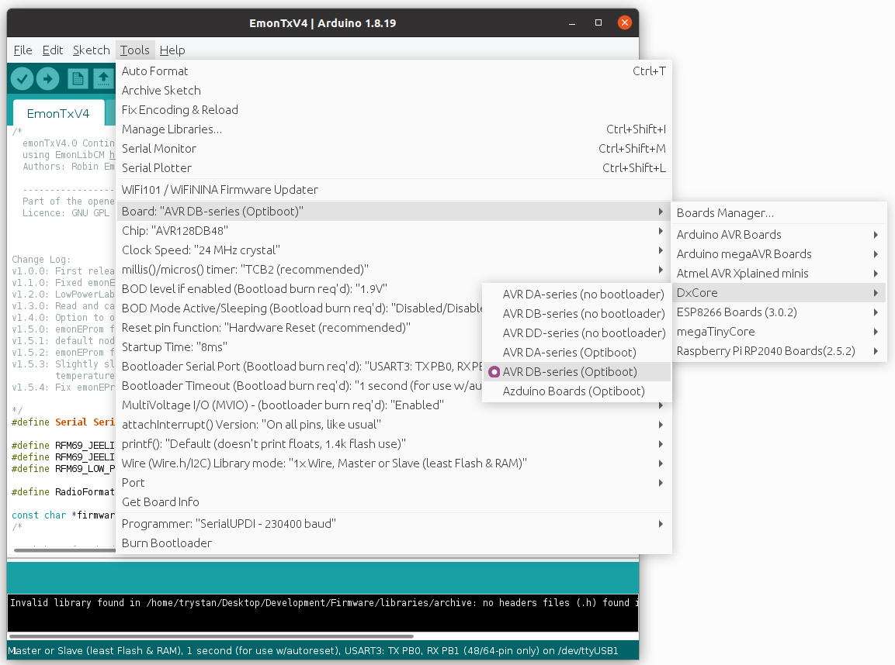
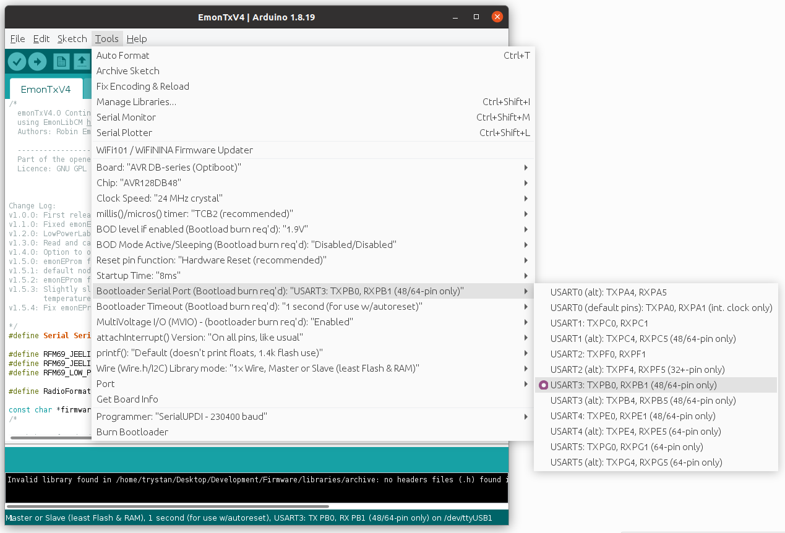

# Firmware

**Updated: 14th May 2024**<br>

There are currently 5 pre-compiled firmware options for the emonTx5 available via both the Emoncms firmware upload tool and the command line `emonupload.py` firmware tool. 

**To choose the right firmware, there are 3 main questions:**

1. Is the application 1-phase, 3-phase or current only?<br>

2. Are you using a 6 channel expander for a total of 12 CT channels?<br>

3. Do you require temperature sensing?<br>

Select the right firmware from the list that matches the requirements of your application:

| ID | Firmware | Voltage | CTs | Temperature | Pulse|
| --- | --- | --- | --- | --- | --- |
|   | **Radio: LowPowerLabs** |   |   |   |   |
| 1 | emonTx5_DB_6CT_1phase_LPL | 1-ph | 6 | 0 | 1* |
| 2 | emonTx5_DB_6CT_3phase_LPL | 3-ph | 6 | 0 | 1* |
| 3 | emonTx5_DB_12CT_1phase_LPL | 1-ph | 12 | 0 | 3* |
| 4 | emonTx5_DB_12CT_3phase_LPL | 3-ph | 12 | 0 | 3* |
| 5 | emonTx5_CM_6CT_temperature_LPL | 1-ph or: current only | 6 | 3 (6 optional) | 1 |

*The pulse sensor * denote standard firmware radio packet support for the number of pulse sensors given. Firmware modification can extend the number of pulse sensors to 3 on all emonLibDB based firmwares.*

- All firmwares transmit data via 433Mhz RFM69CW radio by default and are designed to be used with a receiving emonPi/emonBase base-station. The radio can be turned off via serial configuration if reading data via USB cable.

- All firmwares include serial configuration of radio, voltage and current channel calibration values.

- **_DB:** EmonLib**DB** electricity monitoring library.<br>

- **_CM:**  EmonLib**CM** electricity monitoring library.

- **3-phase firmwares phase allocation:** follows the following pattern: 

  - CT1: phase 1
  - CT2: phase 2
  - CT3: phase 3
  - CT4: phase 1
  - CT5: phase 2
  - CT6: phase 3
  - continued for 12 CT expansion board...

- **Current only:** Supported by firmware 5 & 8 only, can be used with installations without an emonVs voltage sensor. These firmwares uses the older emonLibCM electricity monitoring library that has a fallback option to an assumed RMS voltage value if no AC voltage signal is detected.

- **Temperature sensing:** 
  - Supported by firmware 5 & 8 only. Temperature sensing support is achieved with a very slight degradation in electricity monitoring performance, see forum thread about this [here](https://community.openenergymonitor.org/t/emontx4-ds18b20-temperature-sensing-firmware-release-1-5-7/23496/3).

  - The default maximum number of temperature sensors that can be connected is 3 but this can be increased up to 6 by changing the `#define MAX_TEMPS 3` value at the top of the firmware when compiling and uploading from source.

- **Pulse sensing** is available on the 3 pin analog input terminal as default for all 6 CT firmwares but is disabled by default on the 12 CT firmwares as the analog input is used for CT 12. If temperature sensing is not required it is possible to configure pulse sensing on the terminal blocks connections typically used for temperature sensing.

- **Analog input:** Reading from the analog input can be enabled for all firmware variants via a `#define` compile option when compiling from source.

**Base firmwares**<br>
These are now built from a set of base firmware's common to all AVR-DB hardware variants (emonTx4, emonTx5 and emonPi2) available in the [avrdb_firmware repository](https://github.com/openenergymonitor/avrdb_firmware/)

- Firmwares 1, 2, 6 & 7 compiled from the `emon_DB_6CT` base firmware.
- Firmwares 3 & 4 are compiled from the `emon_DB_12CT` base firmware.
- Firmwares 5 & 8 are compiled from the `emon_CM_6CT_temperature` base firmware.

---

## Updating firmware

The easiest way of updating the emonTx5 firmware is to connect it to an emonBase with a USB cable and then use the firmware upload tool available at `Setup > Admin > Update > Firmware`.

```{warning} 

**System update may be required:** If you don not see the latest firmware version as listed above in the firmware list a full system update is required first.
```

Refresh the update page after connecting the USB cable. You should now see port `ttyUSB0` appear in the 'Select port` list.


Double check the serial port, this is likely to be 'ttyUSB0' when plugged in via USB device connected. Select 'emonTx5' from hardware.

The standard radio format is 'LowPowerLabs', if you wish to use the emonTx5 with an original emonPi (v1) system running JeeLib classic radio format you can select the JeeLib classic radio format here.

## Upload pre-compiled using EmonScripts emonupload2 tool 

On the emonPi/emonBase ensure EmonScripts is updated to latest version then run emonupload2 tool 

    /opt/openenergymonitor/EmonScripts/emonupload2.py

Select hardware then firmware version

```
Select hardware:
  1. emonTx5
  2. emonPi2
  3. emonTx4
  4. emonPi
  5. emonTx3
  6. rfm69pi
  7. rfm12pi
  8. emonTH2
  9. JeeLink
Enter number:1

Select firmware:
1. emonTx5_DB_6CT_1phase_LPL               2.1.0      (Standard LowPowerLabs)
2. emonTx5_DB_6CT_3phase_LPL               2.1.0      (Standard LowPowerLabs)
3. emonTx5_DB_12CT_1phase_LPL              1.2.0      (Standard LowPowerLabs)
4. emonTx5_DB_12CT_3phase_LPL              1.2.0      (Standard LowPowerLabs)
5. emonTx5_CM_6CT_temperature_LPL          1.6.0      (Standard LowPowerLabs)
```

emonupload2 tool can also be run on any other linux computer by cloning the EmonScripts repo then running the emonupload2.py python script. Python3 required 

    git clone https://github.com/openenergymonitor/EmonScripts

## Upload pre-compiled manually using avrdude

Alternatively to upload the same pre-compiled firmware via command line on emonPi / emonBase: 

    avrdude -C/opt/openenergymonitor/EmonScripts/update/avrdude.conf -v -pavr128db48 -carduino -D -P/dev/ttyUSB0 -b115200 -Uflash:w:emonTx5_DB_6CT_1phase_LPL_v2_1_0.ino.hex:i 

Or using different computer, ensure `avrdude.conf` has `avr128db48` entry i.e DxCore see below instructions 

    avrdude -Cavrdude.conf -v -pavr128db48 -carduino -D -P/dev/ttyUSB0 -b115200 -Uflash:w:emonTx5_DB_6CT_1phase_LPL_v2_1_0.ino.hex:i 
    
You will need avrdude installed (tested on version 6.3-2017) and the custom DxCore avrdude.conf. This can be downloaded here: [DxCore avrdude.conf](https://raw.githubusercontent.com/openenergymonitor/EmonScripts/master/update/avrdude.conf).

## How to compile and upload firmware

### Compile and Upload using PlatformIO (recommended)

Clone the `avrdb_firmware` repo 

    git clone https://github.com/openenergymonitor/avrdb_firmware
    cd avrdb_firmware/emon_DB_6CT
    
Open `emon_DB_6CT.ino`, check that the emonTx5 is selected with: `#define EMONTX5`. 

Change any other compile options as required e.g:

- to use JeeLib classic radio format for compatibility with an existing installation change `#define RFM69_LOW_POWER_LABS` to `#define RFM69_JEELIB_CLASSIC`.
- to enable analog read uncomment `#define ENABLE_ANALOG`.
    
Install PlatformIO core then to compile and upload:

    pio run -t upload

On first run PlatformIO will download automatically all the required libraries. You can also use the PlatformIO GUI. 

### Compile and Upload using Arduino IDE 

If you don’t already have the Arduino IDE it can be downloaded from here:<br>
[https://www.arduino.cc/en/software](https://www.arduino.cc/en/software)

Once you have the IDE installed, you then need to install [Spence Konde’s DxCore](https://github.com/SpenceKonde/DxCore). This can be done by first pasting the following board manager URL in Arduino IDE > File > Preferences:

    http://drazzy.com/package_drazzy.com_index.json

Then navigating to: *Tools > Boards > Boards Manager*, Select “DxCore by Spence Konde” and click Install. 


For more information on DxCore installation see: [https://github.com/SpenceKonde/DxCore/blob/master/Installation.md](https://github.com/SpenceKonde/DxCore/blob/master/Installation.md).

**Libraries**

Locate or create your Arduino Sketchbook directory (location found in Arduino preferences). If it doesnt already exist, create a directory called libraries in the Sketchbook directory and install the following libraries:


1\. Download EmonLibCM library (avrdb branch)<br>
[https://github.com/openenergymonitor/EmonLibCM/tree/avrdb](https://github.com/openenergymonitor/EmonLibCM/tree/avrdb)

2\. Download EmonLibDB library (main branch)<br>
[https://github.com/openenergymonitor/emonLibDB](https://github.com/openenergymonitor/emonLibDB)

2\. Download emonEProm library (avrdb branch)<br>
[https://github.com/openenergymonitor/emonEProm/tree/avrdb](https://github.com/openenergymonitor/emonEProm/tree/avrdb)

3\. Download RFM69_LPL library (main branch)<br>
[https://github.com/openenergymonitor/RFM69_LPL](https://github.com/openenergymonitor/RFM69_LPL)

4\. Download RFM69_JeeLib library (avrdb branch)<br>
[https://github.com/openenergymonitor/RFM69_JeeLib/tree/avrdb](https://github.com/openenergymonitor/RFM69_JeeLib/tree/avrdb)

5\. Download DxCore SpenceKonde OneWire library:<br>
[https://github.com/SpenceKonde/OneWire](https://github.com/SpenceKonde/OneWire)

**Open and edit the AVR-DB firmware**

Clone the `avrdb_firmware` repo 

    git clone https://github.com/openenergymonitor/avrdb_firmware

Open the base firmware that you wish to use in the Arduino IDE e.g `emon_DB_6CT.ino`.

Check that the emonTx5 is selected with: `#define EMONTX5`. 

Change any other compile options as required e.g:

- to use JeeLib classic radio format for compatibility with an existing installation change `#define RFM69_LOW_POWER_LABS` to `#define RFM69_JEELIB_CLASSIC`.
- to enable analog read uncomment `#define ENABLE_ANALOG`.

**Compilation settings:**

With DxCore and the libraries installed the firmware should then compile. 

Under Tools, select the following configuration options:

- Select Board "AVR DB-series (Optiboot)"
- Select Chip: AVR128DB48
- Clock Speed: 24 MHz Crystal
- Bootloader serial port: UART3: TXPB0, RXPB1

Select Board "AVR DB-series (Optiboot)"



Select Chip: AVR128DB48


Bootloader serial port: UART3: TXPB0, RXPB1



