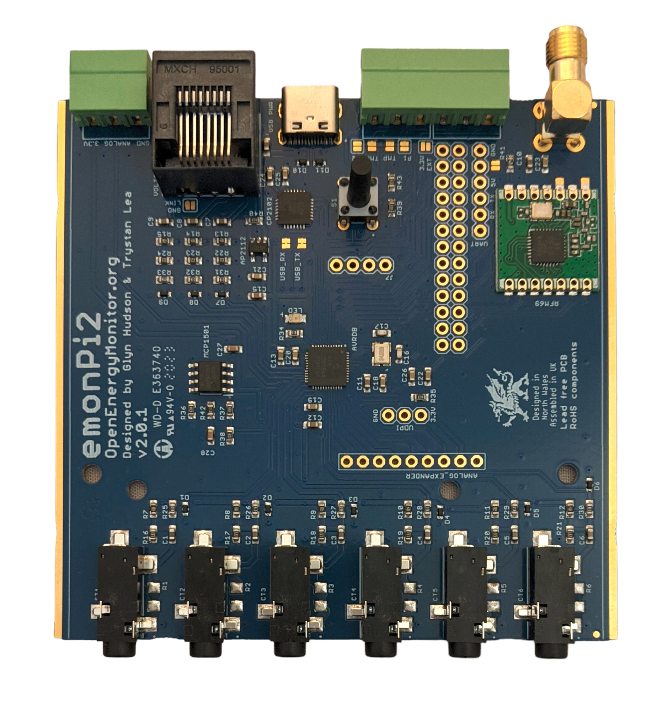
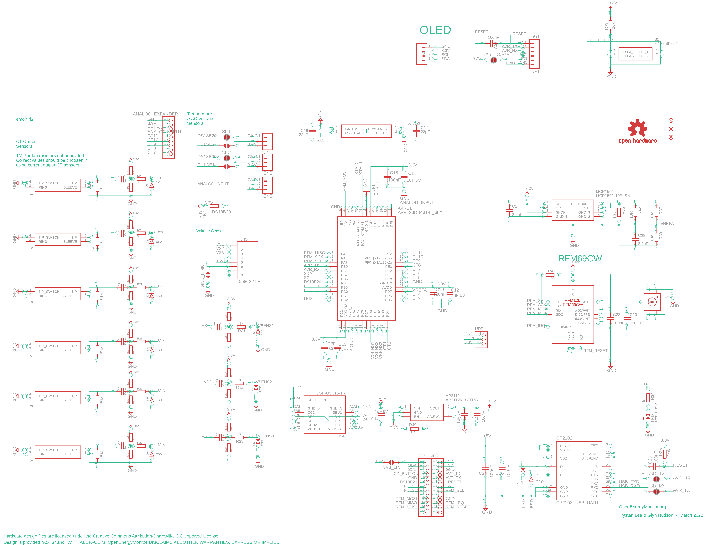
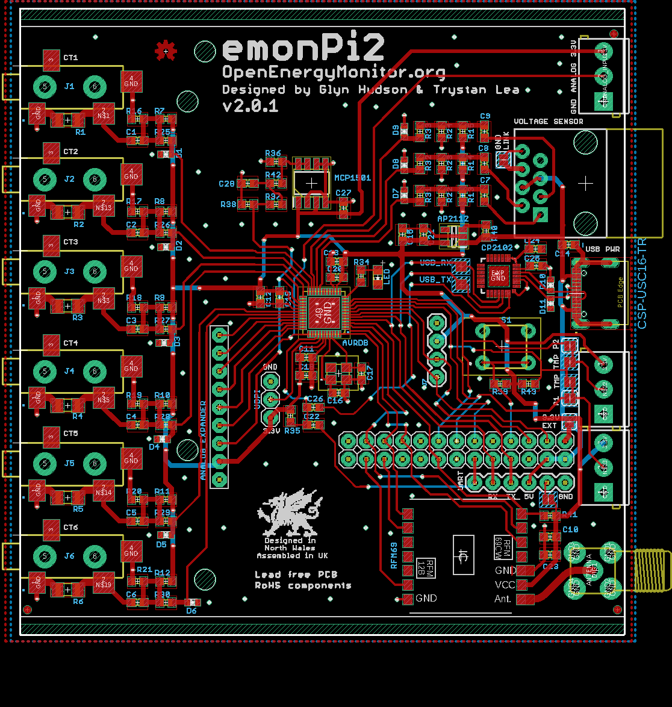
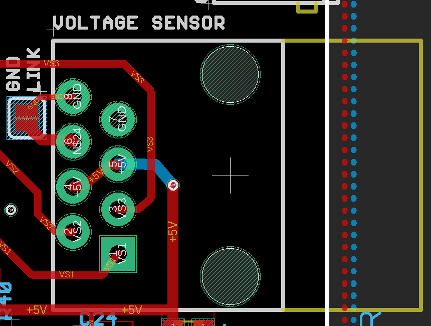
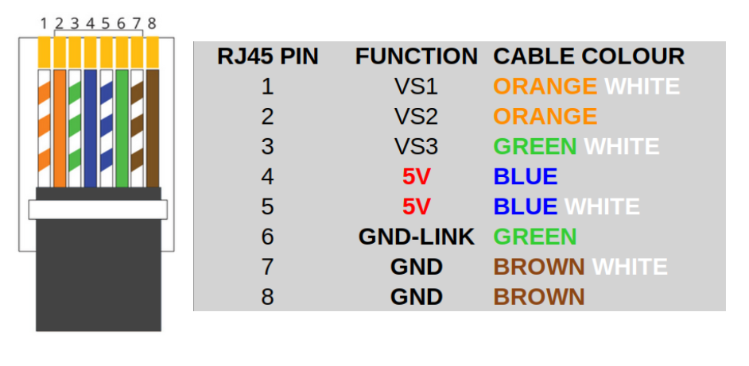

# Hardware

The emonTx5 uses the same measurement board as the emonPi2. The only hardware differences are that the emonTx5 does not include the OLED display, push button, and an attached Raspberry Pi. Its radio module is configured through software to transmit data, rather than receive it, thereby making it an electricity monitoring transmitter node.

## Schematic

## Board layout

## Voltage sensor pinout

