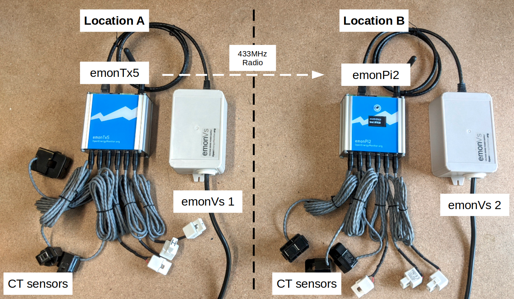
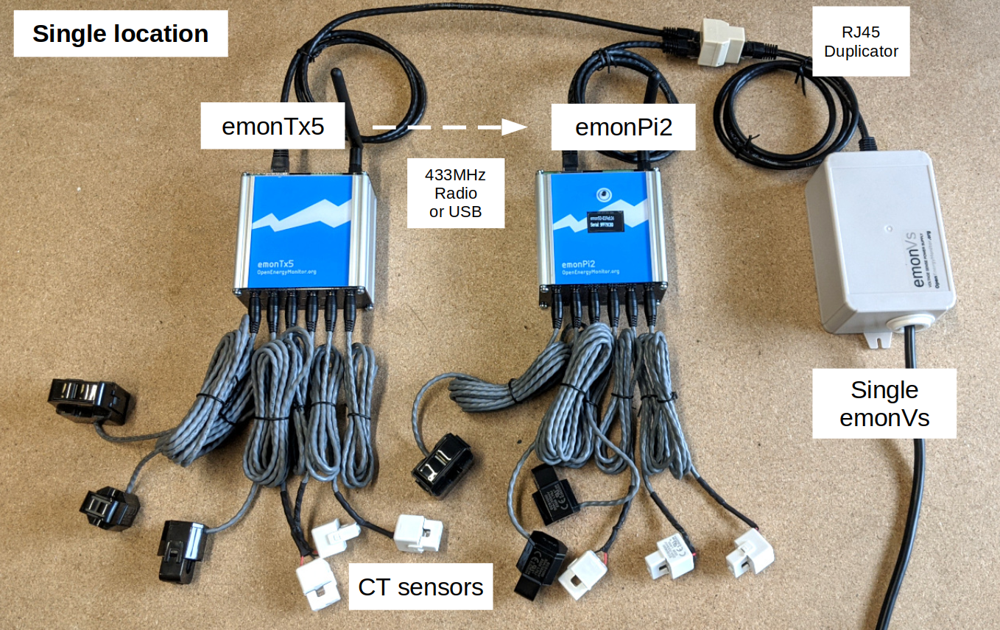
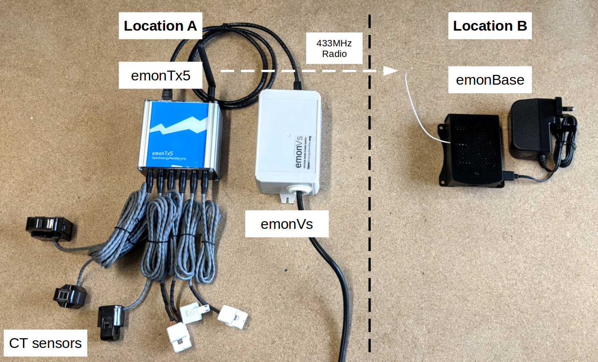

# Install

## System arrangements

The emonTx5 can be used to expand an emonPi monitoring system where more CT inputs are required either in the same location or in a different part of the building.

It can also be used together with an emonBase base-station, where it is useful to have the electricity monitoring at one location and an Ethernet connected base-station in another.

The following gives examples of common system arrangements.

## 1. emonTx5 and emonPi2 in different locations

This arrangement is well-suited for applications that have multiple monitoring points separated by some distance within a building. The emonPi2 might be located at the main consumer unit, while the emonTx5 could be positioned at another consumer unit in the garage.

The emonTx5 and the emonPi2 both require their own emonVs (combined voltage sensor and power supply units, light-grey units to the right of the blue emonTx5 and emonPi2). Data is transmiteed from the emonTx5 (left) to the emonPi2 (right) via 433 MHz radio (which has a practical range similar to WiFi, a 433 MHz repeater can be used if required, [available here](https://shop.openenergymonitor.com/rf-range-extender-433mhz-repeater/)).

## 2. EmonTx5 and emonPi2 in the same location with shared emonVs

The emonPi2 with a Pi Zero 2W inside can be extended from 6 CTs to 12 CTs with an expansion board that fits inside the emonPi2 unit itself. You can have an emonTx5 close by to add another 6 CT channels, or 12 when it too has the expansion board fitted, to take the total to 24 CT channels.

When it is desirable to have a full Raspberry Pi 4B with USB ports and Ethernet in the emonPi2, this limits the number of CTs on the emonPi2 to 6, reducing the possible total CT channels to 18.

The emonVs can be shared between the emonPi2 and the emonTx5 using a RJ45 duplicator (available in the shop [here](https://shop.openenergymonitor.com/emonvs-rj45-duplicator/)).

## 3. emonTx5 and an emonBase base-station

Another common arrangement is to use the emonTx5 with a seperate emonBase base-station. The emonBase can be located next to the internet  router for a hard wired Ethernet connection. 

Data is transmiteed from the emonTx5 (left) to the emonBase (right) via 433 MHz radio (which has a practical range similar to WiFi, a 433 MHz repeater can be used if required, [available here](https://shop.openenergymonitor.com/rf-range-extender-433mhz-repeater/)).

