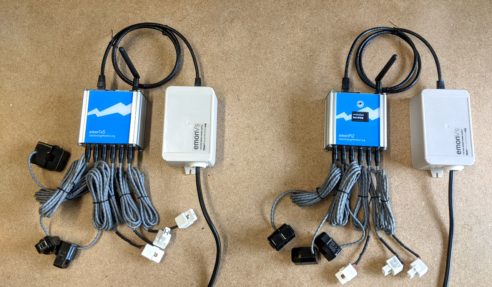
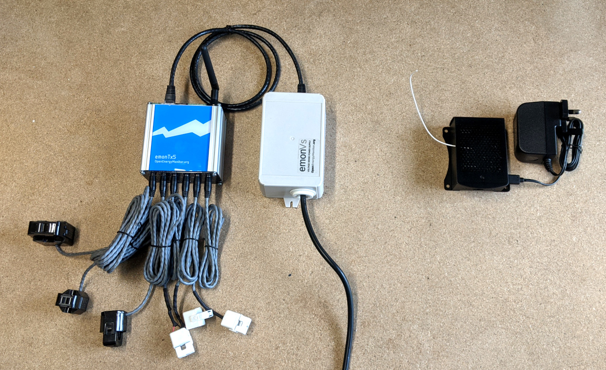

# Install

The emonTx5 can be used to expand an emonPi monitoring system where more CT inputs are required either in the same location or in a different part of the building.

It can also be used together with an emonBase base-station, where it is useful to have the electricity monitoring at one location and an Ethernet connected base-station in another.

The following gives examples of common configurations :

## 1. emonTx5 and emonPi2 in different locations

This configuration is well-suited for applications that have multiple monitoring points separated by some distance within a building. The emonPi2 might be located at the main consumer unit, while the emonTx5 could be positioned at another consumer unit in the garage.

The emonTx5 and the emonPi2 both require their own emonVs (combined voltage sensor and power supply units, light-grey units right of the blue emonTx5 and emonPi2). Data is transmiteed from the emonTx5 (left) to the emonPi2 (right) via 433 Mhz radio (which has a practical range similar to WiFi, a repeater can be used if required).

## 2. EmonTx5 and emonPi2 in the same location with shared emonVs

While an emonPi2 with a Pi Zero 2W can be extended from 6 CT's to 12 CT's with an expansion board that fits inside the emonPi2 unit itself. There are applications where it is useful to have a full RaspberryPi 4B with USB ports and ethernet in the main emonPi2, this limits the number of CT's on the emonPi2 to 6 CT channels.

Additional CT channels can be added in the same location in this case using an emonTx5 with either 6CT's or 12CT options. The emonVs used by the emonPi2 can be shared with the emonTx5 using a RJ45 duplicator. E.g https://www.ebay.co.uk/itm/202336672669

## 3. emonTx5 and an emonBase base-station

Another common configuration is to use the emonTx5 with a seperate emonBase base-station. The emonBase can be located next to the internet  router for a hard wired Ethernet connection. 

Data is transmiteed from the emonTx5 (left) to the emonBase (right) via 433 Mhz radio (which has a practical range similar to WiFi, a repeater can be used if required).

