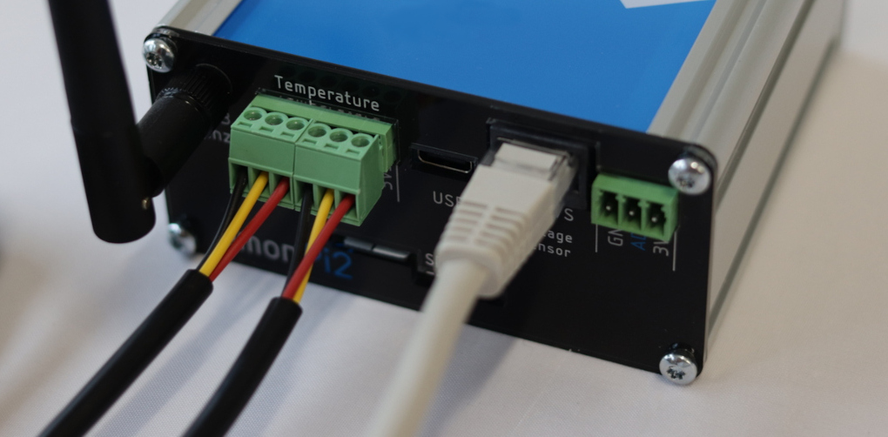
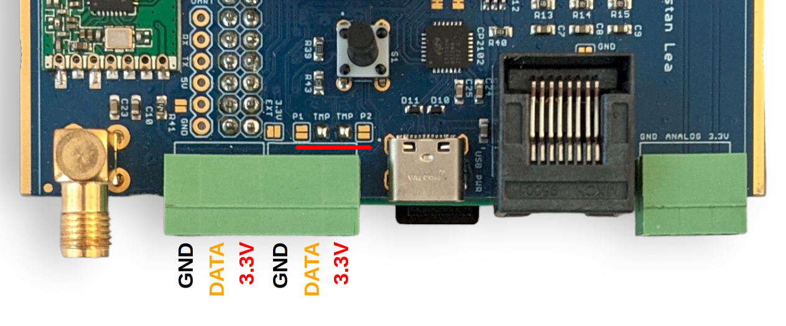
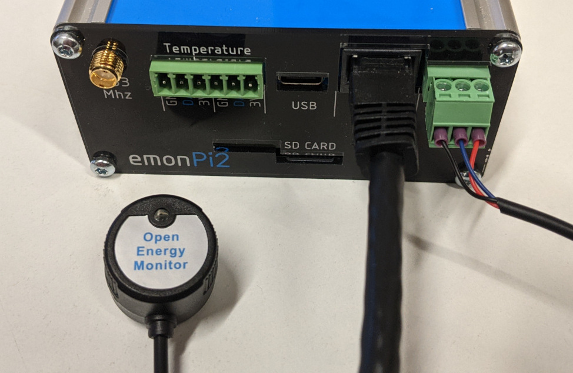
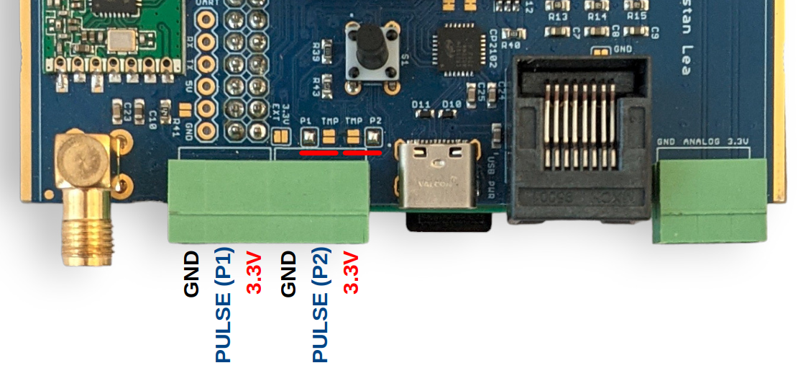
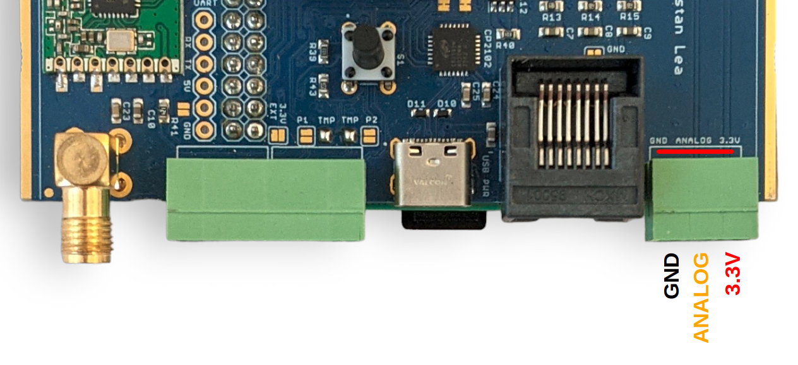
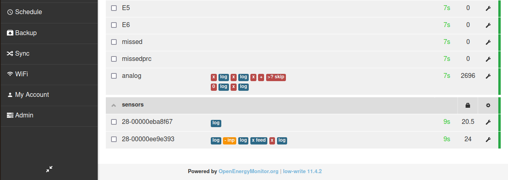
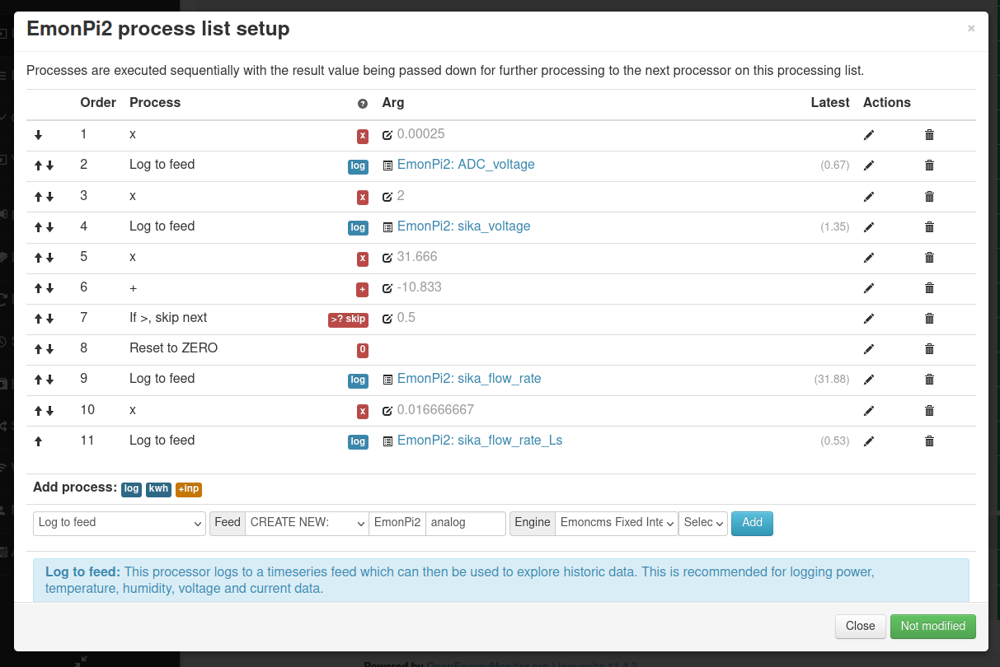
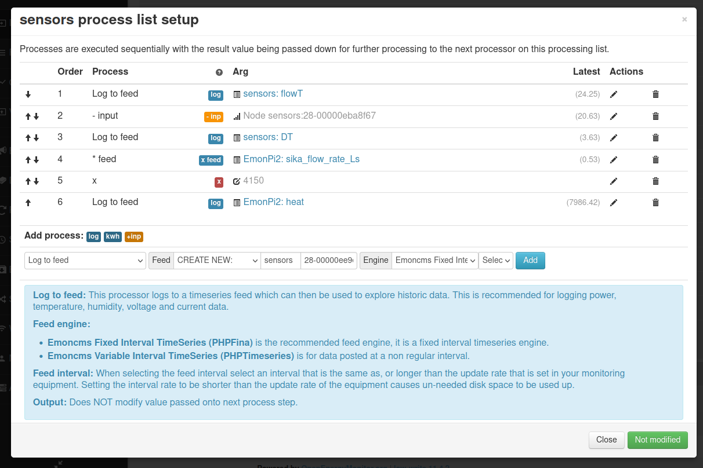
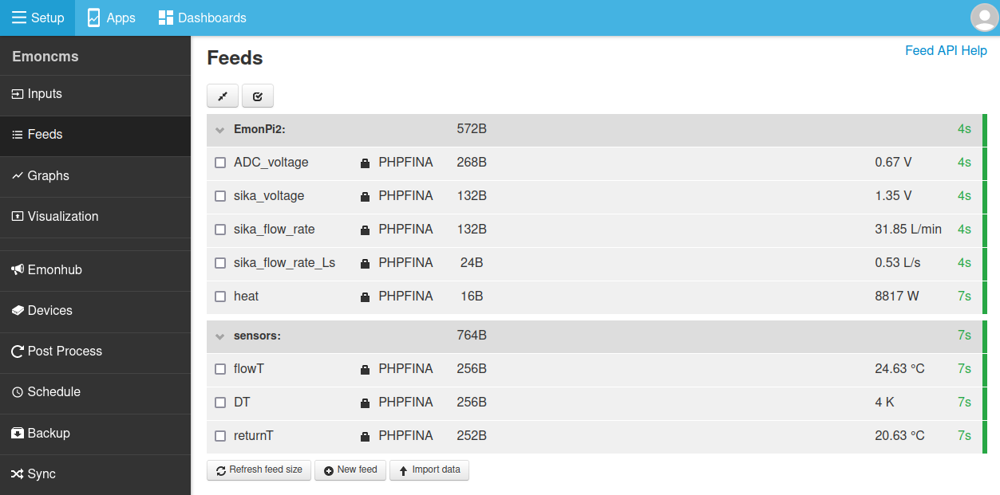

# Other sensors

## Temperature sensing

The emonTx5 supports temperature sensing via [DS18B20 temperature sensors](../electricity-monitoring/temperature/DS18B20-temperature-sensing.md) when using the **single phase 6 CT** emonLibCM *emonTx5_CM_6CT_temperature* firmware. *Please note that temperature sensing is limited to this firmware only and is not available in 3-phase and 12-CT configurations (see note below).*

DS18B20 temperature sensors are small temperature sensors with a 12-bit ADC and a digital output integrated in the sensor itself. Communication is over a one-wire bus and requires little in the way of additional components. The sensors have a quoted accuracy of ±0.5°C in the range -10°C to +85°C.

DS18B20 temperature sensors are connected via the labelled pluggable terminal blocks (multiple sensors can be connected to each temperature input, e.g using a breakout board). *Please note that temperature sensing is not broken out on the RJ45 connector which is for voltage sensing and power only.* 

**Pluggable terminal block connections are:**<br>
GND (black), DATA (yellow), 3.3V (red), left to right, repeated for each of the three blocks:



The function of the emonTx5 terminal blocks can be changed with small solder-jumpers just above the terminals on the measurement board PCB. The default configuration is 2x temperature sensor inputs, one on each terminal block. Notice the bridged solder jumpers labelled 'TMP' in the picture below: 



The DS18B20 input is connected to digital PIN_PB4 on the AVR128DB48 microcontroller.

The *emonTx5_CM_6CT_temperature* firmware supports up to 3x temperature sensors by default. This can be extended to support up to 6x temperature sensors by changing the firmware setting `MAX_TEMPS` at the top of the firmware file *(see base firmware `emon_CM_6CT_temperature` from the [avrdb_firmware](https://github.com/openenergymonitor/avrdb_firmware) repository)*:

```
// 8. The maximum number of temperature sensors that can be read
#define MAX_TEMPS 3
```

**Note:** Due to the way that the one wire protocol works, specifically its requirement for precise timing requiring brief periods of disabling other interrupts on the microcontroller, there is a minor negative impact on electricity monitoring performance when adding temperature sensors. An introduction of ~0.04% error with 3 temperature sensors or 0.07% error with 6 temperature sensors, out of a maximum component tolerance error of 1.2%. Please see the detailed forum post on this here: [EmonTx4 DS18B20 Temperature sensing & firmware release 1.5.7](https://community.openenergymonitor.org/t/emontx4-ds18b20-temperature-sensing-firmware-release-1-5-7/23496).

Temperature sensing is unfortunately not supported when using the more recent emonLibDB electricity monitoring library and associated firmwares: *emonTx_DB_6CT_1phase*, *emonTx_DB_6CT_3phase* and *emon_DB_12CT*. There is more going on in this electricity monitoring library in order to support 3-phase measurement and it was not possible to integrate temperature sensing in the same way. Please use the earlier single phase emonLibCM based firmware *emonTx4_CM_6CT_temperature* if you do require temperature sensing at the emonTx5 measurement point.

For applications that require temperature sensing and 3-phase emonTx5 monitoring or up to the 12 CT sensors, we recommend using a seperate USB powered emonTH2 with multiple external temperature sensors to achieve this.

## Pulse counting

When running the latest emonTx5 single phase or three phase firmware, pulse counting is attached to the analog input as standard (consistent with emonPi2 configuration default)

The OpenEnergyMonitor pulse counter can connected like this:




This pulse input will appear alongside the energy monitoring data from the emonTx5 on the emoncms inputs page. For pulse counting applications without the emonVs voltage sensor connected make sure to be running the single phase *emonTx5_CM_6CT_temperature* firmware. 

---

**Pulse sensing using the terminals labelled 'temperature'**:

While the left hand side terminal block inputs are configured for temperature sensing as standard, it's possible to change the function of the 'Data' pin on each of the terminal block inputs. The following picture shows both inputs configured for pulse counting rather than temperature sensing, notice the moved solder pad bridges:



```{note}
<b>P1</b> can be either a pulse input (AVR-DB PIN_PB5) or temperature sensing (AVR-DB PIN_PB4)

<b>P2</b> can be either a pulse input (AVR-DB PIN_PC0) or temperature sensing (AVR-DB PIN_PB4)
```

---

## Analog input

When CT 12 is not required, it is possible to link analog input AIN19 (CT12) to right-most terminal block as shown here. An example application is measuring flow rate using a Sika VFS which has an analog voltage output.



```{warning}
The analog input voltage must be in the range **0 - 1.024V**. This ADC is configured for this range in order to suit the 333mV CT sensors.
```

```{warning}
When using a 6 CT expansion board it is still possible to use the analog input in place of CT12 (leaving 11 CT inputs). Remove the header pin that links CT12 on the expansion board to the emonPi2/Tx5 measurement board PCB to do this.
```

Using the analog input requires compiling and uploading custom configuration of the emonTx5 firmware. Start by setting up the Arduino IDE environment following the [firmware guide](firmware.md).

Open the base firmware `emon_DB_6CT` from the [avrdb_firmware](https://github.com/openenergymonitor/avrdb_firmware) firmware repository.

1\. Make sure to select EMONTX5 as the hardware variant:

```
// 1. Set hardware variant
// Options: EMONTX4, EMONTX5, EMONPI2
#define EMONTX5
```

2\. Uncomment the line `#define ENABLE_ANALOG`:

```
// 6. Enable analog reading (disabled by default)
// #define ENABLE_ANALOG
```

3\. Select 1phase or 3phase as required:

```
// 3. Set number of voltage channels (1 for single phase, 3 for three phase)
#define NUM_V_CHANNELS 1
```

4\. Compile and upload the firmware to the emonTx5

With this firmware loaded the analog input will appear in the input list.

The following set of screenshots gives an example of configuring this analog input for use in reading the flow rate from a Sika VFS flow sensor. The flow rate is then used together with measurement of flow and return temperature to calculate heat.

*These screenshots show inputs labelled as emonPi2 but the process is exactly the same for the emonTx5:*








